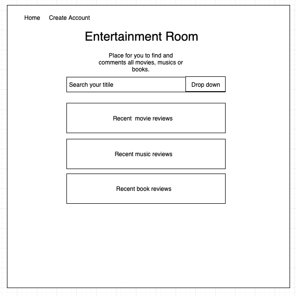
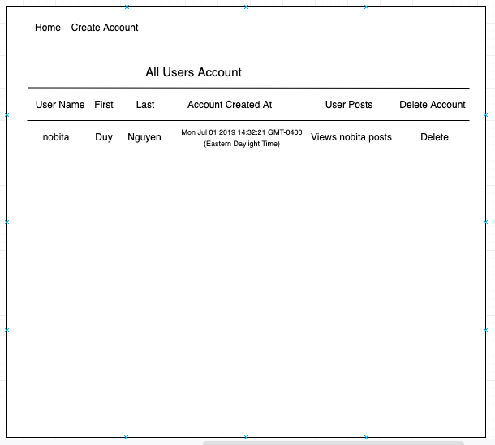
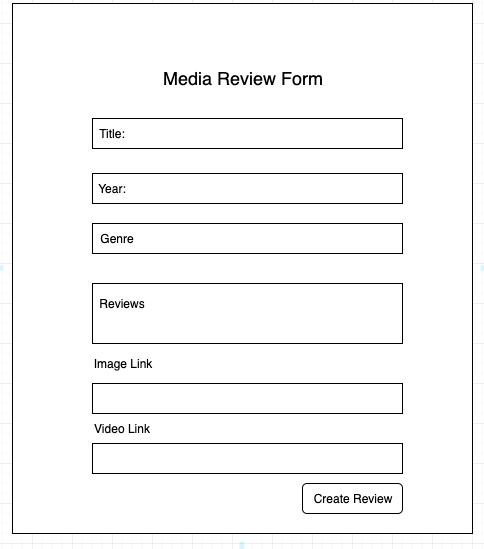
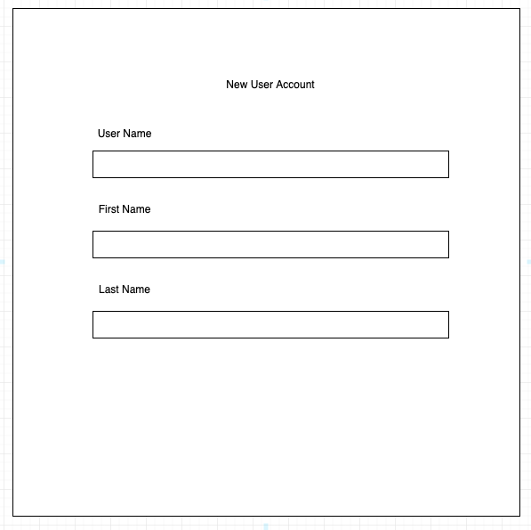
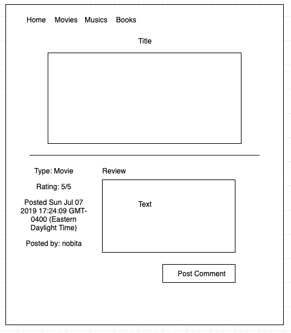
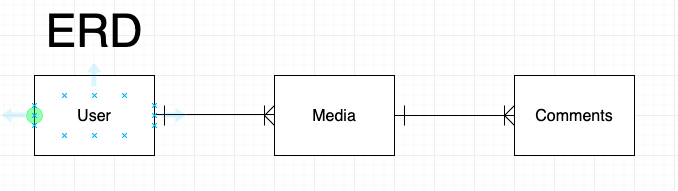

# PROJECT #2: 

## Overview
For project #2, I choose to create a simple fullstack app for users to post their reviews about the media 
(movies, musics, or books) that they interested in. Also, viewer could leave comments about the media reviews to show their different opinions. This app helps the users to pick out their favourite media and keep up to date new movies, musics or books. 

## Technologies Used
- Node.js, Express.js
- Languages - HTML, CSS, Javascript
- View - Handlebar
- Database - MongoDB, Mongoose
- Text Edition - Visual Studio Code

## Links
- Project Planning:
<a href="https://trello.com/b/O6zDNUPA/entertainment-room" target="_blank">Trello</a>
- Project Hosted:
<a href="https://lit-chamber-33132.herokuapp.com/media" target="_blank">Heroku</a>

## Features
3 models:               
- user model            
- media model           
- comment model         
3 controllers:   
- user controller
- media controller
- comment controller
- home controller (show landing page)

## Future Improvements
- Create User Authentication
- Route user to comment

## Wireframe

## Wireframe
